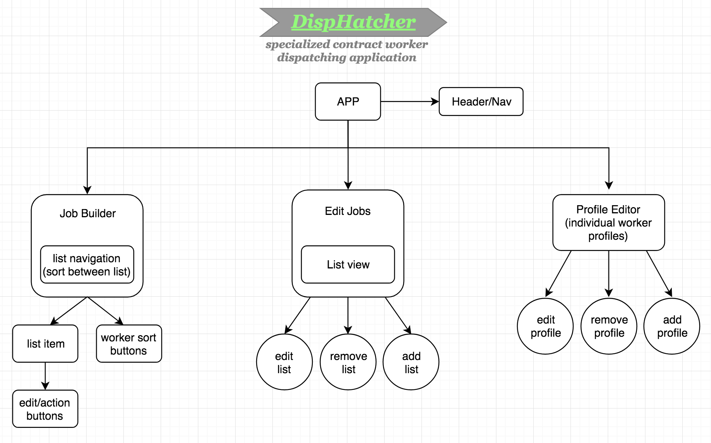
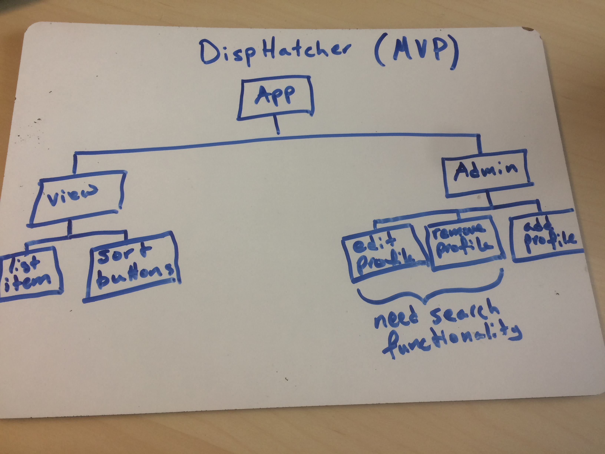
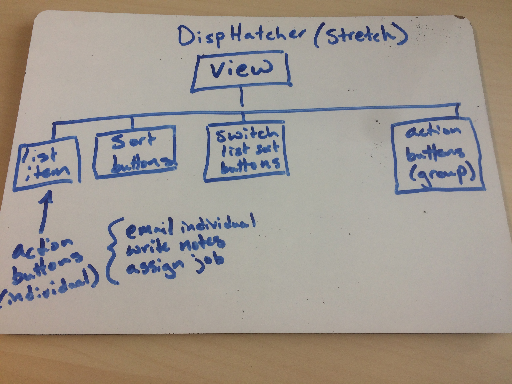
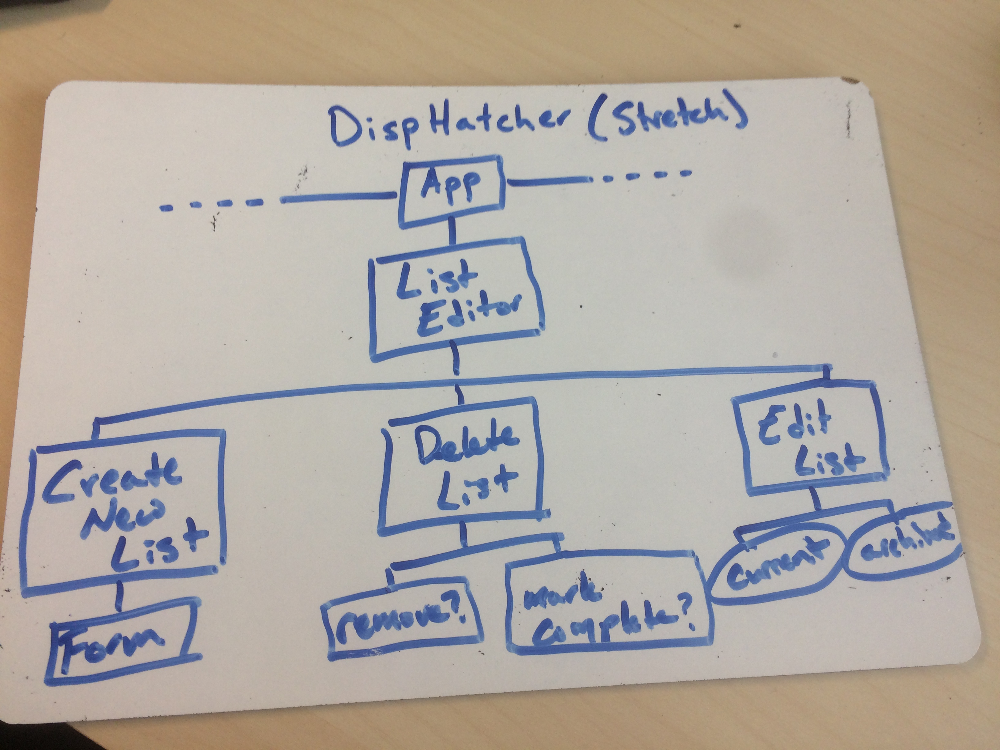
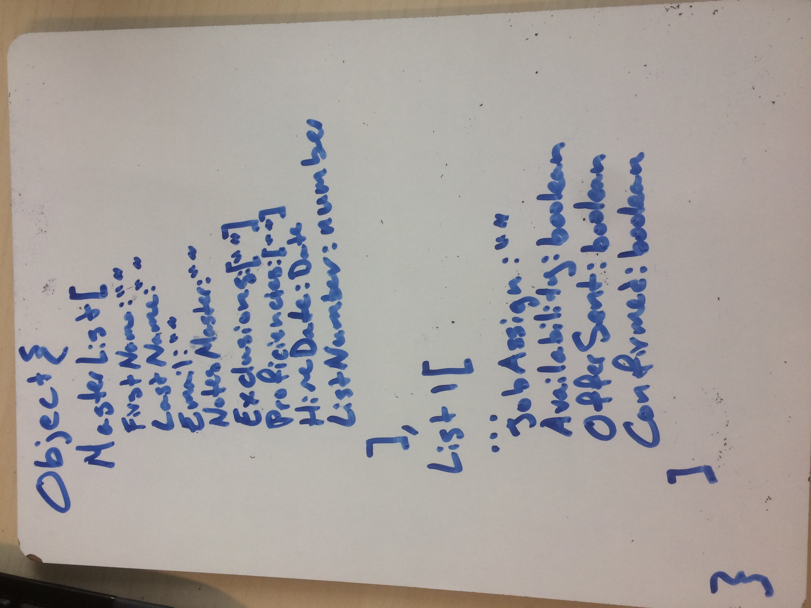

## React DispHatcher
#### _Epicodus Capstone Project, 5/3/19_

#### Slater Smith

### Description

Application built for React routing and state management practice using Redux. The application is meant to act as a worker dispatcher for organizations that need to manage large numbers of contract workers in realtime. Specifically, this app is being built with trade unions in mind, but could be applicable to any industry that needs to efficiently manage, track, and dispatch contract workers or employees (examples: dental professionals, medical, government workers, police dispatch, temp agencies, etc.)

### Component Tree

### Features
The user can currently add and remove new workers in the 'profiles' view, create and remove new job calls in the 'job builder' view, and see those job calls and members with job specific data appear in the 'dispatcher view.' This app is still under construction, as errors occur when the user makes updates in the 'dispatcher' view. See 'Current Bugs' section in this README for more information.

### Roadmap & Stretch Goals
MVP:
- Fully build out Job Builder & Profile Editor components using mock data and mock job lists.
- Deploy to firebase.

Stretch goals:
- Build out Edit Jobs component, and have each job automatically archive after timeout (job call ends).
- In 'Profile Editor' component, add 'search by name' option, and a 'view all' option to choose from
- Add option for user to create new job-types (Rigger, Electricial, Lead Rigger) and sort by them.
- Add preset job-types for different industries (Stagehands Union, Electricians Union, etc.)
- Add ability to upload excel sheet list of workers, then delete mock data
- Add functionality to send emails

#### Database/Sort-items map:

Master list data:
- First name
- Last name
- Email
- Proficiencies / Skills
- Notes / General
- Exclusions
- Hire Date / Seniority
- List Number / Seniority

Data / job specific:
- Notes / This Job
- Job assignment
- Availability (warning pops up if assigned to conflicting job)
- Offer sent
- Confirmation

### Technologies and Resources Used

* React
* npm & Node
* Redux (to be implemented)
* Jest (to be implemented)

### Setup Instructions

1. Clone this repository to your desktop at https://github.com/SlaterJamesSmith/disp-hatcher
2. Use a terminal of your choice to access the webpage and its files by inputting: "git clone {the above clone link}"
3. If homebrew is not yet installed on your Mac, install it by running the following command in your terminal: "$ /usr/bin/ruby -e "$(curl -fsSL https://raw.githubusercontent.com/Homebrew/install/master/install)"
4. If you are not using a Mac, and homebrew is not yet installed, go to the node website and follow appropriate installer for your operating system at https://nodejs.org/en/download/
5. Navigate into your new directory and run '$ npm i' and then 'npm run start'
6. In your preferred web browser, navigate to url 'localhost:8080'

### Current Bugs
This project is still in progress. While it does successfully implement Redux, errors occur in the 'dispatcher' view when an edit is made to the status of a particular worker on a particular job. Instead of updating a single instance of that worker, the application updates the information accross all jobs. The issue may be that state is being mutated, or possibly the way information about a particular list is being accessed.

This project will meet MVP when this issue is addressed. 

### License

*This software is licensed under the MIT license*
Copyright (c) 2019 **_Slater Smith_**
